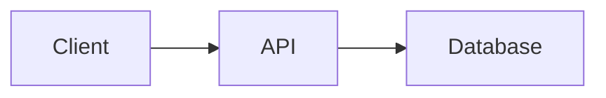

# Repository README

Create or update the root `README.md` using a consistent visual-first documentation style.

The README must be:

- visually recognizable;
- concise;
- easy to scan;
- evidence-based;
- useful to developers;
- consistent across repositories.

Prefer visual hierarchy over long prose.

## Core principle

A reader opening the repository should understand within a few seconds:

1. what the project is;
2. what technology it uses;
3. whether CI/release status exists;
4. how to run it;
5. where to find deeper documentation.

Avoid walls of text.

---

# 1. Inspect before writing

Before editing `README.md`, inspect relevant repository evidence:

- current `README.md`;
- project manifests;
- dependency and lock files;
- source tree;
- test configuration;
- CI workflows;
- deployment configuration;
- Docker files;
- `.env.example`;
- API specifications;
- documentation directories;
- repository assets;
- license;
- Git metadata when available.

Never invent:

- features;
- versions;
- CI status;
- deployments;
- commands;
- integrations;
- coverage;
- release status;
- architecture;
- URLs.

Preserve useful existing information unless it is obsolete, duplicated or contradicted by repository evidence.

---

# 2. Visual-first header

Every README should begin with a strong visual element.

Preferred order:

```text
HERO / PROJECT IMAGE

PROJECT NAME

short tagline

badges

technology icons
```

Do not begin with multiple paragraphs.

## Hero and visual identity

The README header must feel like a designed project identity, not an automatically generated technical diagram.

The hero is a visual branding surface.

### Visual hierarchy

Prefer this composition:

```text
LOGO / SYMBOL

PROJECT WORDMARK

short tagline

status badges

technology icons
```

The project should remain recognizable even if the explanatory text is removed.

### Logo design

When no established project logo exists and creating repository assets is allowed, create an original lightweight SVG mark.

The logo must be:

- visually distinctive;
- minimal;
- geometric or editorial rather than illustrative;
- recognizable at small sizes;
- appropriate for both GitHub README presentation and future reuse;
- related conceptually to the project without literally diagramming its architecture.

Prefer abstract symbolism derived from the project's purpose.

Examples:

- publishing project → page, type, editorial grid, cursor, narrative flow;
- evidence project → chain, fingerprint, verification mark, immutable sequence;
- AI project → constellation, nodes, signal, abstraction;
- infrastructure project → modular geometry, topology, connected forms;
- mobile product → gesture, interaction, signal, relationship.

Do not simply draw the application architecture.

### Avoid generic AI-generated branding

Do not create logos consisting primarily of:

- boxes connected by arrows;
- pipeline stages;
- generic network-node diagrams;
- terminal windows;
- code brackets;
- database cylinders;
- cloud icons;
- robot heads;
- arbitrary gradients;
- project initials placed inside a generic circle or hexagon.

These may appear in technical diagrams, but they should not define the project's visual identity.

### Composition

Use a deliberate visual composition rather than filling the canvas.

Prefer:

- asymmetry when appropriate;
- generous negative space;
- one dominant visual idea;
- strong silhouette;
- restrained geometry;
- coherent alignment.

Do not fill every area of the hero.

### Color system

Use a small palette:

- 1 dominant background or neutral;
- 1 primary accent;
- optionally 1 secondary accent;
- text neutrals.

Prefer approximately 2–4 meaningful colors.

Avoid generic blue-purple gradients unless the repository already has that identity.

When the project has an existing design system, derive colors from it.

Otherwise select a palette appropriate to the project's character and keep it consistent across the SVG, badges where practical, and supporting assets.

### Typography

Treat typography as part of the identity.

Prefer a strong wordmark treatment with:

- clear hierarchy;
- deliberate spacing;
- restrained font weight;
- good contrast.

Do not make every project look like a developer dashboard.

Monospace fonts may be used for small technical labels, but should not automatically become the primary visual identity.

Prefer system-safe SVG font stacks unless text has been converted to vector paths.

### Hero image

The hero may combine:

- the logo mark;
- the project wordmark;
- subtle graphical motifs;
- one short tagline.

It should not contain substantial documentation.

Avoid putting feature lists, architecture stages or multiple technical labels into the hero.

Preferred aspect ratio:

```text
approximately 3:1 to 4:1
```

Recommended width:

```text
960–1200 px
```

A hero should still look intentional when scaled down on GitHub.

### Separate branding from explanation

Technical architecture belongs later in:

```md
## 🧱 Architecture
```

The hero communicates identity.

The architecture section communicates structure.

Do not merge these two responsibilities.

### Asset structure

When generating branding assets, prefer:

```text
docs/assets/
├── logo.svg
└── readme-hero.svg
```

`logo.svg` should contain the reusable project mark or wordmark.

`readme-hero.svg` may use that identity in a wider GitHub-specific composition.

Do not make the README hero the only representation of the logo.

### Quality gate

Before accepting a generated visual, ask:

1. Would this still be recognizable without the project name?
2. Does it look like a brand rather than a diagram?
3. Could the mark reasonably be reused as an app icon, website mark or documentation logo?
4. Is there one clear visual idea?
5. Does it avoid generic developer-tool aesthetics?
6. Does it still work at small size?
7. Is the SVG simple enough to maintain?

If several answers are no, redesign it before updating the README.

---

# 3. Project identity

Immediately after the hero:

```md
# Project Name

Short description of the project in one sentence.
```

The description should normally be **one sentence**.

Maximum preferred length:

```text
~160 characters
```

Do not add generic marketing copy.

Bad:

```text
This innovative and revolutionary application provides a robust,
modern, scalable and cutting-edge ecosystem designed to...
```

Good:

```text
Django portfolio backend with Wagtail-managed content and a JSON API for the React frontend.
```

---

# 4. Badges

Place badges directly below the description.

Prefer Shields.io or authoritative provider badges.

Recommended categories:

- CI;
- release/version;
- license;
- coverage;
- package publication;
- runtime/framework version;
- deployment status when authoritative.

Example:

```html
<p align="left">
  
  
  
</p>
```

or standard Markdown badge syntax.

## Badge rules

Use only badges whose values can be verified.

Prefer approximately:

```text
2–6 badges
```

Avoid badge walls.

Badges should communicate **project status**, not duplicate the entire tech stack.

Prefer a single consistent badge style within the README.

Recommended style:

```text
flat-square
```

or:

```text
for-the-badge
```

Do not mix multiple visual styles without a reason.

---

# 5. Technology icons

After badges, show the primary stack visually when useful.

Skill Icons may be used:

```html
<p>
  
</p>
```

Only include technologies confirmed by repository evidence.

Show only primary technologies.

Prefer:

```text
3–8 icons
```

Do not turn dependency lists into icon walls.

Minor libraries belong in documentation, not in the visual header.

When a technology is unsupported by the selected icon provider, omit it rather than using inconsistent arbitrary images.

---

# 6. Optional visual preview

For applications with a meaningful UI, CLI output, hardware result or generated artifact, place one representative image after the header.

Examples:

```md

```

Suitable content includes:

- application screenshot;
- CLI output;
- architecture visualization;
- hardware photo;
- generated result;
- product interface.

One strong image is preferable to several weak ones.

Do not add screenshots merely for decoration.

---

# 7. README information architecture

Use only sections justified by repository evidence.

Preferred order:

1. visual header;
2. project identity;
3. badges;
4. stack icons;
5. optional preview;
6. Overview;
7. Quick Start;
8. Architecture;
9. Development;
10. Testing;
11. API or Interfaces;
12. Deployment;
13. Project Structure;
14. Contributing;
15. License.

Small projects should use fewer sections.

Never create empty sections.

---

# 8. Overview

Keep the Overview extremely compact.

Preferred length:

```text
1–3 short paragraphs
```

or approximately:

```text
50–120 words
```

Explain only:

- what the project does;
- its principal execution model;
- important context not obvious from the header.

Prefer bullets when they communicate the same information more clearly.

---

# 9. Quick Start

Quick Start is one of the most important sections.

Prefer executable commands over explanation.

Example:

```md
## 🚀 Quick Start

```bash
git clone ...
cd ...
uv sync
uv run ...
```
```

Use the tooling selected by the repository.

Do not silently replace:

- `pnpm` with `npm`;
- `uv` with `pip`;
- Gradle with Maven;
- project scripts with generic commands.

Commands must be supported by repository evidence.

---

# 10. Section icons

Use one relevant icon or emoji in major headings to improve scanning.

Example:

```md
## 🚀 Quick Start

## 🧱 Architecture

## 🛠️ Development

## 🧪 Testing

## 🔌 API

## 🚢 Deployment

## 📁 Project Structure

## 🤝 Contributing

## 📄 License
```

Use a consistent icon vocabulary across repositories.

Do not place emojis throughout normal prose.

Icons are navigation aids, not decoration.

---

# 11. Architecture

Prefer diagrams and concise component descriptions over long architecture essays.

For suitable projects use GitHub-compatible Mermaid:



Only include relationships supported by repository evidence.

For simple projects, omit the diagram.

A compact table is also acceptable:

```md
| Component | Responsibility |
| --- | --- |
| `backend/` | API and business logic |
| `frontend/` | User interface |
```

---

# 12. Tech Stack details

Do not create a large prose section describing obvious technologies already represented by icons.

When additional context is useful, use a small table:

```md
| Layer | Technology |
| --- | --- |
| Backend | Django |
| Database | PostgreSQL |
| Mobile | React Native / Expo |
| CI | GitHub Actions |
```

Use exact versions only when authoritative.

---

# 13. Development commands

Prefer a command table:

```md
## 🛠️ Development

| Command | Purpose |
| --- | --- |
| `uv sync` | Install dependencies |
| `uv run pytest` | Run tests |
| `uv run ruff check .` | Run linting |
```

Every command must exist or be directly supported by project configuration.

---

# 14. Testing and quality

Keep this section operational.

Example:

```md
## 🧪 Testing

```bash
uv run pytest
uv run ruff check .
```
```

Use badges for current CI/coverage status when authoritative.

Do not state that tests pass unless current evidence supports that claim.

---

# 15. Project structure

Show only important paths.

Example:

```text
.
├── apps/       # Applications
├── packages/   # Shared packages
├── docs/       # Documentation
└── tests/      # Automated tests
```

Prefer approximately:

```text
4–10 entries
```

Do not dump the full repository tree.

---

# 16. Configuration

Document configuration only when necessary.

Prefer:

```md
cp .env.example .env
```

and a small table for important variables.

Never expose:

- passwords;
- API keys;
- tokens;
- private keys;
- credentials;
- secrets.

---

# 17. API and interfaces

If the repository exposes a public interface, document its entry point concisely.

Examples:

- OpenAPI;
- REST API;
- MCP;
- CLI;
- package API;
- deep links.

Prefer links to canonical detailed documentation instead of duplicating it.

---

# 18. Deployment

Include deployment information only when supported by repository configuration or authoritative documentation.

Prefer commands, links and workflow names over long explanations.

Do not expose sensitive infrastructure details.

---

# 19. Table of contents

Do **not** automatically create a table of contents.

Add one only when the README is sufficiently long that navigation materially improves usability.

For short or medium README files, headings are sufficient.

---

# 20. Writing style

Optimize for scanning.

Prefer:

- short sentences;
- short paragraphs;
- code blocks;
- images;
- badges;
- icons;
- concise tables;
- diagrams;
- links to deeper documentation.

Avoid:

- paragraphs longer than roughly 5 lines;
- repeated explanations;
- generic boilerplate;
- marketing filler;
- obvious implementation commentary;
- decorative complexity;
- excessive HTML;
- excessive emoji;
- giant tables.

A README should feel like a polished project landing page, not a specification document.

Detailed documentation belongs under:

```text
docs/
```

or equivalent project documentation.

---

# 21. Progressive disclosure

Apply this principle:

```text
README
    ↓
understand project
    ↓
run project
    ↓
find deeper docs
```

The README is the entry point.

It does not need to contain every project detail.

When detailed documentation already exists, link to it.

---

# 22. Consistency across repositories

Repositories using this skill should share recognizable presentation conventions:

- hero at the top;
- concise project description;
- compact badge row;
- primary technology icons;
- consistent heading icons;
- Quick Start near the top;
- commands over prose;
- restrained section count;
- detailed documentation linked instead of duplicated.

Project content may vary.

Visual language should remain consistent.

---

# 23. Validation

Before finishing:

1. verify every factual claim against repository evidence;
2. verify commands against project configuration;
3. verify referenced local files exist;
4. verify image paths;
5. verify badge targets;
6. verify technology icons represent technologies actually used;
7. remove empty sections;
8. remove redundant prose;
9. remove unsupported claims;
10. inspect the final README as a GitHub landing page;
11. review the diff.

Ask:

> Can a developer understand the project and reach the Quick Start without reading a wall of text?

If not, simplify the README.

The finished README should prioritize:

**visual identity → project understanding → execution → deeper documentation.**
